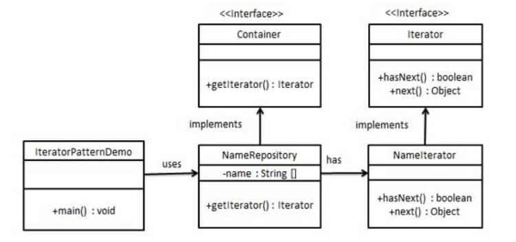

# 迭代器

迭代器模式是`Java`和`.Net`编程环境中非常常用的设计模式。这种模式用于顺序访问集合对象的元素，不需要知道集合对象的底层表示，其属于行为模式。

### 介绍

**意图：**提供一种方法顺序访问一个聚合对象中的各个元素，而又无须暴露该对象的内部表示。

**主要解决：**不同的方式来遍历整个整合对象。

**何时使用：**遍历一个聚合对象。

**如何解决：**把在元素之间游走的责任交给迭代器，而不是聚合对象。

**关键代码：**定义接口：`hasNext`，`next`。

**应用实例：**`Java`中的`iterator`。

**优点：**

1. 它支持以不同的方式遍历一个聚合对象。
2. 迭代器简化了聚合类。
3. 在同一个聚合上可以有多个遍历。
4. 迭代器模式中，增加新的聚合类和迭代器都很方便，无须修改原有代码。

**缺点：**由于迭代器模式将存储数据和遍历数据的职责分离，增加新的聚合类需要对应增加新的迭代器类，类的个数成对增加，这在一定程度上增加了系统的复杂性。

**使用场景：**

1. 访问一个聚合对象的内容而无须暴露它的内部表示。
2. 需要为聚合对象提供多种遍历方式。
3. 为遍历不同的聚合结构提供一个统一的接口。

注意事项：迭代器模式就是为了分离了集合对象的遍历行为，抽象出一个迭代器类来负责，这样即可以做到不暴露集合的内部结构又可以让外部代码透明地访问集合内部的数据。

### 实现

创建一个叙述导航方法的`Iterator`接口和一个返回迭代器的`Container`接口。实现了`Container`接口的实体类将负责实现`Iterator`接口。`IteratorPatternDemo`作为演示类，它使用实体类`NamesRepository`来打印`NamesRepository`中储存为集合的`Names`。



**步骤一：**

创建`Iterator`接口和`Container`接口。

```java
public interface Iterator {

    //判断是否还有下一个值
    public boolean hasNext();
    //返回下一个值的内容
    public Object next();
}
```

```java
public interface Container {

    //返回迭代器
    public Iterator getIterator();
}
```

**步骤二：**

```java
public class NameRepository implements Container{
    
    public String names[] = {"张三", "李四", "王五", "赵六"};
    
    @Override
    public Iterator getIterator(){
        return new NameIterator();
    }
    
    private class NameIterator implements Iterator{
        
        int index;
        @Override
        public boolean hasNext() {
           if (index < names.length){
               return true;
           }
           return false;
        }

        @Override
        public Object next() {
            if (hasNext()){
                return names[index++];
            }
            return null;
        }
    } 
}
```

**步骤三：**

使用 `*NameRepository*` 来获取迭代器，并打印名字。

```java
public class IteratorPatternDemo {
    public static void main(String[] args) {

        NameRepository nameRepository = new NameRepository();
        Iterator iter = nameRepository.getIterator();

        while (iter.hasNext()){
            String name = (String)iter.next();
            System.out.println(name);
        }
    }
}
```

**运行结果：**

```java
张三
李四
王五
赵六
```

