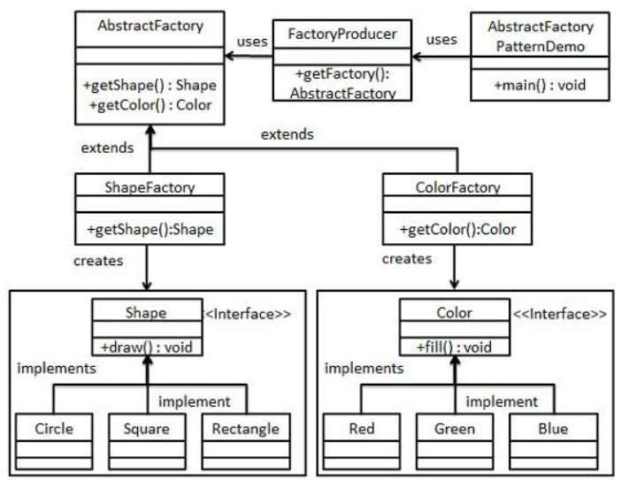

# 抽象工厂模式

抽象工厂模式是围绕一个超级工厂创建其他工厂。该超级工厂又称为其他工厂的工厂。这种类型的设计模式属于创建型模式，它提供了一种创建对象的最佳方式。

在抽象工厂模式中，接口是负责创建一个相关对象的工厂，不需要显示指定它们的类。每个生成的工厂都能够按照工厂模式提供对象。

### 介绍

**意图：**提供一个创建一系列相关或相互依赖对象的接口，而无需指定它们具体的类。

**主要解决：**主要解决接口选择的问题。

**何时使用：**系统的产品有多于一个的产品族，而系统只消费其中某一族的产品。

**如何解决：**在一个产品族里面定义多个产品。

**关键代码：**在一个工厂里聚合多个同类产品。

**应用实例：**工作了，为了参加一些聚会，需要准备两套或多套衣服，比如说有商务装（成套，一系列具体产品），时尚装（成套，一系列具体产品），甚至对于一个家庭来说，可能有商务女装，商务男装，时尚女装，时尚男装，这些也都是成套的，即一系列具体产品。用 `OOP` 的思想去理解，所有的衣柜（具体工厂）都是衣柜类的（抽象工厂）某一个，而每一件成套的衣服又包括具体的上衣（某一具体产品），裤子（某一具体产品），这些具体的上衣其实也都是上衣（抽象产品），具体的裤子也都是裤子（另一个抽象产品）。

**优点：**当一个产品族中的多个对象被设计成一起工作时，它能保证客户端始终只使用同一产品族中的对象。

**缺点：**产品族扩展非常困难，要增加一个系列的某一产品，既要在抽象的Creator里加代码，又要在具体的里面加代码。

**使用场景：**

1. `QQ`换皮肤，一整套一起换。
2. 生成不同操作系统的程序。

**注意事项：**产品族难扩展，产品等级易扩展。

### 实现

我们将创建`Shape`和`Color`接口和实现这些接口的实体类。下一步是创建抽象工`AbstractFactory`。接着定义工厂类`ShapeFactory`和`ColorFactory`，这两个工厂类都是扩展了`AbstractFactory`。然后创建一个工厂创造器/生成器类`FactoryProducer`。`AbstractFactoryPatternDemo`，演示类使用`FactoryProducer`来获取`AbstractFactory`对象。它将向`AbstractFactory`传递形状信息Shape（Circle / Square  / Rectangle），以便获取它所需对象的类型。同时它还向`AbstractFactory`传递颜色信息`Color`（Red / Green / Blue），以便获取它所需对象的类型。



**步骤一：**

创建`Shape`接口。

```java
public interface Shape {
    //创建一个drew方法
    void draw();
}
```

**步骤二：**

实现`Shape`接口（Circle, Square, Rectangle）。

```java
public class Circle implements Shape {
    @Override
    public void draw() {
        System.out.println("绘制圆形");
    }
}
```

```java
public class Square implements Shape {
    @Override
    public void draw() {
        System.out.println("绘制正方形");
    }
}
```

```java
public class Renctangle implements Shape {
    @Override
    public void draw() {
        System.out.println("绘制长方形");
    }
}
```

**步骤三：**

创建`Color`接口。

```java
public interface Color {
    //创建一个fill方法
    void  fill();
}
```

**步骤四：**

实现`Color`接口（Red, Green, Blue）。

```java
public class Red implements Color {
    @Override
    public void fill() {
        System.out.println("填满红色");
    }
}
```

```java
public class Green implements Color {
    @Override
    public void fill() {
        System.out.println("填满绿色");
    }
}
```

```java
public class Blue implements Color {
    @Override
    public void fill() {
        System.out.println("填满蓝色");
    }
}
```

**步骤五：**

为 Color 和 Shape 对象创建抽象类来获取工厂。

```java
public abstract class AbstractFactory {
    
    public abstract Shape getShape(String shapeType);
    public abstract Color getColor(String colorType);
}
```

**步骤六：**

创建扩展`AbstractFactory`的工厂类（ `ShapeFactory`,`ColorFactory`），基于给定的信息生成实体类。

```java
public class ShapeFactory extends AbstractFactory{

    //使用 ShapeFactory 继承 AbstractFactory，得到 shape 信息
    @Override
    public Shape getShape(String shapeType) {
        if (shapeType == "circle"){
            return new Circle();
        } else if (shapeType == "square"){
            return new Square();
        } else if (shapeType == "rectangle"){
            return new Renctangle();
        }else {
            return null;
        }
    }

    //颜色信息返回 null
    @Override
    public Color getColor(String colorType) {
        return null;
    }
}
```

```java
public class ColorFactory extends AbstractFactory {

    //形状信息返回 null
    @Override
    public Shape getShape(String shapeType) {
        return null;
    }

    //使用 ColorFactory 继承 AbstractFactory，得到 color 信息
    @Override
    public Color getColor(String colorType) {
        if (colorType == "red"){
            return new Red();
        } else if (colorType == "green"){
            return new Green();
        } else if (colorType == "blue"){
            return new Blue();
        }else {
            return null;
        }
    }
}
```

**步骤六：**

创建一个工厂创造器/生成器类，通过传递形状或颜色信息来获取工厂。

```java
public class FactoryProducer {

    //创建一个工厂创造器/生成器，通过传递的信息来获取工厂
    public static AbstractFactory getFactory(String factory){
        if (factory == "shape"){
            return new ShapeFactory();
        } else if (factory == "color"){
            return new ColorFactory();
        } else {
            return null;
        }
    }
}
```

**步骤七：**

使用 `FactoryProducer` 来获取 `AbstractFactory`，通过传递类型信息来获取实体类的对象。

```java
public class AbstractFactoryPatternDemo {
    public static void main(String[] args) {
        //不使用静态方法
        FactoryProducer factoryProducer = new FactoryProducer();
        Shape shape1 = factoryProducer.getFactory("shape").getShape("circle");
        shape1.draw();

        //使用静态方法
        AbstractFactory shapeFactory = FactoryProducer.getFactory("shape");
        Shape shape2 = shapeFactory.getShape("square");
        shape2.draw();

        Shape shape3 = shapeFactory.getShape("rectangle");
        shape3.draw();

        AbstractFactory colorFactory = FactoryProducer.getFactory("color");
        Color color1 = colorFactory.getColor("red");
        color1.fill();

        Color color2 = colorFactory.getColor("green");
        color2.fill();

        Color color3 = colorFactory.getColor("blue");
        color3.fill();
    }
}
```

运行结果：

```java
绘制圆形
绘制正方形
绘制长方形
填满红色
填满绿色
填满蓝色
```

