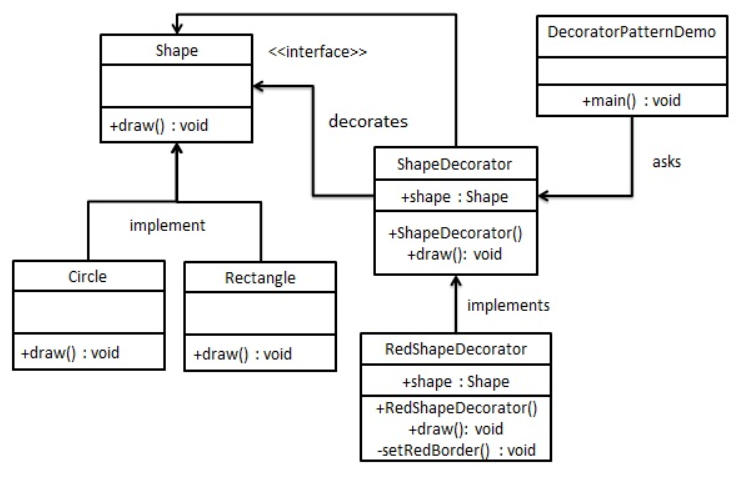

# 装饰器模式

装饰器模式允许向一个现有的对象添加新的功能，同时又不改变其结构。这种类型的设计模式属于结构型模式，它是作为现有的类的一个包装。

这种模式创建了一个装饰类，用来包装原有的类，并在保持类方法签名完整性的前提下，提供了额外的功能。

通过下面的实例来演示装饰器模式的用法。把一个形状装饰上不同的颜色，同时又不改变形状类。

### 介绍

**意图：**动态地给一个对象添加一些额外的职责。在增加功能方面来说，其比生产子类更为灵活。

**主要解决：**为了扩展一个类通常使用继承方式来实现，由于继承为类引入静态特征，并且随着扩展功能的增多，子类会很臃肿。

**何时使用：**在不想增加很多子类的情况下扩展类。

**如何解决：**将具体功能职责划分，同时继承装饰者模式。

**关键代码：**

1. `Commponent`类充当抽象角色，不应该具体实现。
2. 修饰类引用和继承`Commponent`类，具体扩展类重写父类方法。

**应用实例：**

1. 孙悟空有72变，当他变成庙宇后，它的根本还是一只猴子，但是他又有了庙宇的功能。
2. 不论一幅画有没有画框都可以挂在墙上那，但是通常都是有画框的，并且实际上是画框被挂在墙上。在挂上墙上之前，画可以被蒙上玻璃，装到框子里，这时画，玻璃和画框形成了一个物体。

**优点：**装饰类和被装饰类可以独立发展，不会相互耦合，装饰器模式是继承的一个替代模式，装饰模式可以动态扩展一个实现类的功能。

**缺点：**多层装饰比较复杂。

**使用场景：**

1. 扩展一个类的功能。
2. 动态增加功能，动态撤销。

**注意事项：**可替代继承。

### 实现

创建一个`Shape`接口和实现了`Shape`接口的实体类。然后再创建一个实现了`Shape`接口的抽象装饰类`ShapeDecorator`，并把`Shape`对象作为他的实例变量。

`RedShapeDecorator`是实现了`ShapeDecorator`的实体类。

`DecoratorPatternDemo`为演示类，使用`RedShapeDecorator`来装饰`Shape`对象



**步骤一：**

创建`Shape`接口。

```java
public interface Shape {

    void draw();
}
```

**步骤二：**

创建`Shape`的实现类。

```java
public class Circle implements Shape {

    @Override
    public void draw() {
        System.out.println("绘制圆形");
    }
}
```

```java
public class Rectangle implements Shape {

    @Override
    public void draw() {
        System.out.println("绘制长方形");
    }
}
```

**步骤三：**

创建一个实现了`Shape` 接口的抽象装饰类`ShapeDecorator`。

```java
public abstract class ShapeDecorator implements Shape {

    protected Shape decoratedShape;
    //使用构造函数将变量实例化
    public ShapeDecorator(Shape decoratedShape){
        //this调用自身类的构造函数
        this.decoratedShape = decoratedShape;
    }

    @Override
    public void draw() {
        decoratedShape.draw();
    }
}
```

**步骤四：**

实现抽象装饰类`ShapeDecorator`。

```java
public class RedShapeDecorator extends ShapeDecorator {

    public RedShapeDecorator(Shape decoratedShape) {
        //调用父类的构造方法
        super(decoratedShape);
    }

    @Override
    public void draw() {
        //当将decoratedShape设置为private时，可以通过super来调用draw方法
        decoratedShape.draw();
        setRedBorder(decoratedShape);
    }

    private void setRedBorder(Shape decoratedShape){
        System.out.println("填充红色");
    }
}
```

**步骤五：**

使用 `ShapeDecorator`来装饰 *Shape* 对象。

```java
public class DecoratorPatternDemo {
    public static void main(String[] args) {

        Shape circle = new Circle();
        circle.draw();
        //前面的类型信息可以是Shape ShapeDecorator RedShapeDecorator其中任何一个
        Shape redCircle = new RedShapeDecorator(new Circle());
        redCircle.draw();

        ShapeDecorator redRectangle = new RedShapeDecorator(new Rectangle());
        redRectangle.draw();
    }
}
```

**运行结果：**

```java
绘制圆形
绘制圆形
填充红色
绘制长方形
填充红色
```

